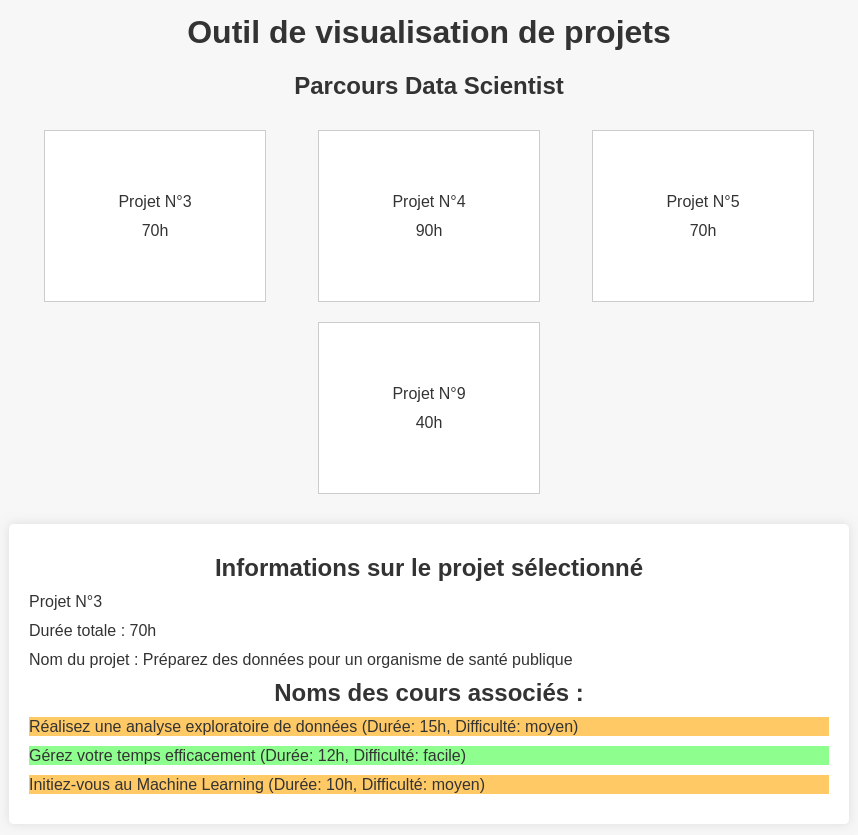
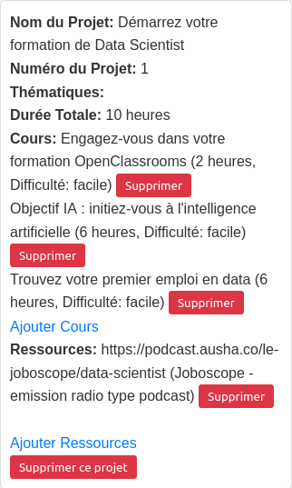
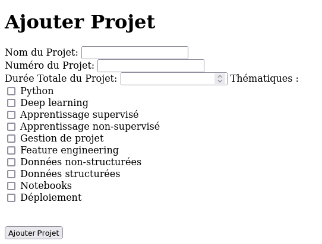
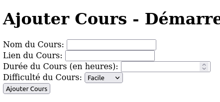
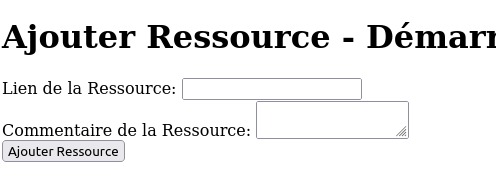
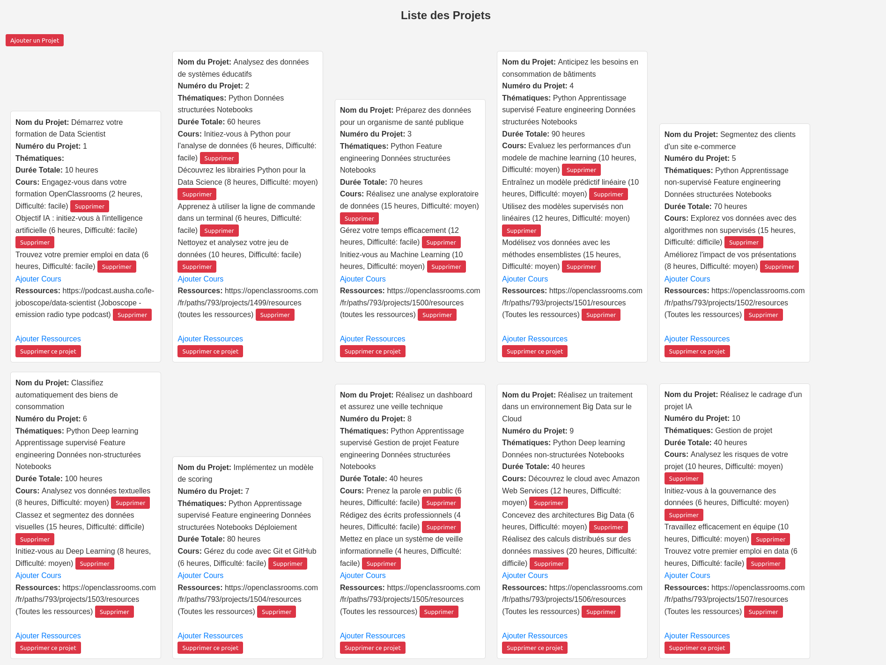

# EdHubConnect

Bienvenue sur EdHubConnect, une plateforme éducative innovante pour la gestion de projets pédagogiques et la visualisation de parcours d'apprentissage.




## Aperçu

EdHubConnect est conçu pour simplifier la poursuite d'un parcours pédagogique basé sur la méthode d'apprentissage par projets. 
L'utilisateur peut d'une part créer la liste des projets à réaliser, y associer des cours, des thématiques, des ressources, le tout à sa guise, en y associant des informations telles que la durée du cours, sa difficulté etc...
D'autre part, un module de visualisation permet de prendre conscience de l'étendue du travail à réaliser afin de réussir son parcours pédagogique.

## Fonctionnalités

- **Gestion de Projets :** Créez, modifiez et organisez des projets éducatifs.
- **Thématiques et Cours :** Créez des listes de thématiques prédéfinies, créez des cours, associez le tout aux projets.
- **Visualisation de Parcours :** Obtenez une vue d'ensemble de votre parcours grâce à des outils de visualisation interactifs.

## Installation

Pour démarrer avec EdHubConnect, suivez ces étapes :

```bash
# Cloner le dépôt
git clone https://github.com/Stabadev/edhubconnect.git

# Installer les dépendances
cd edhubconnect
pip install -r requirements.txt
```

## Utilisation

1. **Exécution de l'Application Feed:** Lancez l'application feed en utilisant la commande suivante :

   ```bash
   cd ~/edhubconnect/edhubconnectfeed
   python app.py
   ```
   L'application va servir Flask sur l'adresse locale [http://127.0.0.1:5001](http://127.0.0.1:5001).
   On peut utiliser l'application en se rendant sur cette adresse dans son navigateur préféré.

2. **Création de la liste des thématiques** Avant toute chose, on renseignera la liste des thématiques qu'il sera possible par la suite d'associer à des cours. Pour ce faire il suffit de se rendre sur l'adresse suivante : [http://127.0.0.1:5001/admin/](http://127.0.0.1:5001/admin/)


   
3. **Création de la base de donnée projet.db** 

 - Créer les projets
 
On commencera par faire la liste des projets qu'il faudra réaliser lors de son parcours pédagogique. 
Lorsqu'on créé un projet, il faut renseigner

*numéro du projet* : un nombre entier, 1, 2, .. 12, etc

*intitulé du projet* : le nom du projet, chaîne de caractère

*durée du projet* : un nombre d'heures, 10, 30, ... 80, etc

*thématiques* : on viendra cocher parmi les thématiques disponibles dans la liste renseignées précédemment, celles qui sont abordées dans le cours

  

 - Associer des cours aux projets

Une fois qu'un projet est créé, on va renseigner la liste des cours conseillée par l'équipe pédagogique afin de pouvoir réaliser les projets correctement. 
Lorsqu'on renseigne un cours, on donne :

*nom du cours* : l'intitulé du cours

*lien du cours* : un lien https://www...

*durée du cours* : un nombre, en heures

*difficulté du cours* : à choisir parmi trois options, facile, moyen et difficile

  
 - Associer des ressources aux projets

Chaque ressource possède deux caractéristiques : 

*lien vers la ressource*

*commentaire*
    
   

Les informations renseignées dans cette interface seront ajoutées et structurées directement dans le fichier `projet.db`

Une fois cette étape réalisée, on pensera à interrompre l'exécution de l'application dans le terminal par la combinaison de touches suivantes : `Ctrl` + `C`

 

4.  **Exécution de l'application edhubconnectview**

 - Préalable

On va avant toute chose venir copier coller le fichier `projet.db` généré lors de l'étape précédente dans le dossier racine de l'application edhubconnectview. 

 - Démarrage

   ```bash
   cd ~/edhubconnect/edhubconnectview
   python app.py
   ```
L'application va servir Flask sur l'adresse locale [http://127.0.0.1:5000](http://127.0.0.1:5000).
On peut désormais visualiser les données de la base de donnée projet.db grâce à l'application edhubconnectview en se rendant sur cette adresse dans son navigateur préféré.

 - Visualisation

Selon les informations renseignées dans la base de donnée `projet.db`, à l'aide de l'outil EdHubConnectFeed, l'outil de visualisation EdHubView affiche de manière conviviale et lisible le contenu de celle-ci. 
Un système carte contenant au recto le numéro du projet et son intitulé, réagit au survol du curseur de la souris par l'affichage des détails du projet, cours, thématiques, ressources associées etc... L'affichage des éléments de détails peut être modulé selon des critères spécifiques (ex: couleur verte pour un cours facile, orange pour un cours moyen, rouge pour un cours difficile).

Cet outil de visualisation est extrêmement basique, il n'y a pas de modularité possible quant à l'affichage des informations. 
J'aimerai faire évoluer cette fonctionnalité pour permettre à l'utilisateur d'obtenir des informations visuellement plus pertinentes, et personnalisées selon ses souhaits. 

 


## Structure du Projet

```
edhubconnect/
│
├── edhubconnectfeed/
│   ├── app.py
│   └── templates
│   │    └── ajouter_cours.html
│   │    └── ajouter_projet.html
│   │    └── ajouter_ressourceshtml
│   │    └── index.html
│   │    └── supprimer_projet.html
│   └── static/
│   │    └── css/
│   │        └── styles.css
│   └── instance/
│        └── projet.db
├── edhubconnectview/
│   ├── app.py
│   └── templates/
│   │    └── index.html
│   └── static/
│   │        └── styles.css
│   └── projet.db
├── README.md
└── requirements.txt
```
## Contribuer

You're welcome

## Licence

GNU GENERAL PUBLIC LICENSE
Version 3, 29 June 2007

Copyright (C) 2023 edhubconnect

This program is free software: you can redistribute it and/or modify
it under the terms of the GNU General Public License as published by
the Free Software Foundation, either version 3 of the License, or
(at your option) any later version.

This program is distributed in the hope that it will be useful,
but WITHOUT ANY WARRANTY; without even the implied warranty of
MERCHANTABILITY or FITNESS FOR A PARTICULAR PURPOSE.  See the
GNU General Public License for more details.

You should have received a copy of the GNU General Public License
along with this program.  If not, see <https://www.gnu.org/licenses/>.


